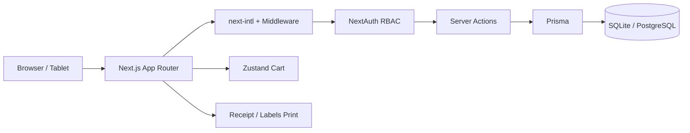

# سۆقی — Soqi POS

### A modern grocery Point-of-Sale & store management system

Built for real shop floors — cashiers, warehouse staff, and owners who need speed, clarity, and zero friction.

[](https://nextjs.org/)
[](https://www.typescriptlang.org/)
[](https://www.prisma.io/)
[](https://tailwindcss.com/)
[](#internationalization)
[](LICENSE)

---

## Why this project exists

Most POS tools are either too heavy for a mini-market or too crude for serious daily use.
**Soqi** is the middle ground: a clean, bilingual (Kurdish Sorani + English) system with a large-touch POS screen, stock control, receipts, labels, and role-based access — designed so non-technical staff can run a store with confidence.

> Built as a full-stack portfolio piece that demonstrates product thinking, UX for real users, and production-minded engineering.

---

## Features

| Module | What it does |
|--------|----------------|
| **Dashboard** | Today’s sales, transaction count, trend charts, top products, low-stock alerts, quick shortcuts |
| **POS / Checkout** | Category tabs, barcode scanner input, cart with steppers, cash/card + change, hold/resume sale, keyboard shortcuts, receipt print |
| **Inventory** | Product CRUD, stock levels, category & supplier links, low-stock filters, card/table views |
| **Stock intake & adjust** | Bulk receiving and damage/expiry/lost adjustments with reason logging |
| **Categories & suppliers** | Visual category colors/icons; supplier contacts and product links |
| **Sales & reports** | Filterable history, reprint receipts, revenue/profit/margin, best sellers, sales by cashier, PDF/Excel export |
| **Barcode labels** | Generate and print product barcode labels (JsBarcode) |
| **Users & roles** | Admin / Cashier / Warehouse with sidebar permissions |
| **Settings** | Store name, address, phone, currency (IQD), receipt footer & width, language |
| **i18n + RTL** | Kurdish Sorani (RTL, default) and English (LTR) with persisted user locale |

### POS ergonomics (the stuff cashiers feel)

- Large product cards and primary actions
- USB/HID barcode scanner support (fast keystrokes ending in Enter)
- Shortcuts: search, complete sale, quantity changes
- Optimistic cart updates (no waiting on the server to feel responsive)
- Offline queue for sales when the connection drops mid-checkout
- Thermal receipt layout (58mm / 80mm) via `window.print()`

---

## Tech stack

```text
Frontend     Next.js 14 (App Router) · TypeScript · Tailwind CSS · shadcn/ui · Zustand · Recharts
Auth         NextAuth.js · JWT sessions · role-based route guards
Data         Prisma ORM · SQLite (local) · ready for PostgreSQL
i18n         next-intl · locale routes (/ckb, /en) · RTL/LTR · Intl formatters
Extras       react-hot-toast · JsBarcode · jsPDF · SheetJS (xlsx)
```



---

## Screens (modules)

```text
/ckb                  → Dashboard (Admin)
/ckb/pos              → Point of Sale
/ckb/inventory        → Products & stock
/ckb/inventory/intake  → Bulk stock intake
/ckb/inventory/adjust → Stock adjustments
/ckb/categories       → Category management
/ckb/suppliers        → Suppliers
/ckb/sales            → History & reports
/ckb/labels           → Barcode labels
/ckb/users            → User management
/ckb/settings         → Store settings
```

Switch language anytime with the globe in the top bar. Preference is saved on the user.

---

## Quick start

### Prerequisites

- Node.js 18+
- npm

### 1. Clone

```bash
git clone https://github.com/omerpirot7/soqi-pos.git
cd soqi-pos
```

### 2. Install & configure

```bash
npm install
cp .env.example .env
```

Edit `.env` if needed (defaults work for local SQLite):

```env
DATABASE_URL="file:./dev.db"
NEXTAUTH_URL="http://localhost:3000"
NEXTAUTH_SECRET="replace-with-a-long-random-string"
```

### 3. Database + seed

```bash
npx prisma db push
npm run db:seed
```

### 4. Run

```bash
# Fast Turbopack dev server
npm run dev

# Or production (snappy navigation)
npm run build && npm start
```

Open **[http://localhost:3000](http://localhost:3000)** — redirects to `/ckb`.

---

## Demo accounts

| Role | Email | Password |
|------|-------|----------|
| **Admin** | `admin@store.local` | `admin123` |
| **Cashier** | `cashier@store.local` | `cashier123` |
| **Warehouse** | `warehouse@store.local` | `warehouse123` |

Seed data includes grocery categories, products (rice, oil, drinks, snacks…), suppliers, and sample sales so the UI is demoable immediately.

---

## Roles & permissions

| Capability | Admin | Cashier | Warehouse |
|------------|:-----:|:-------:|:---------:|
| Dashboard & reports | ✅ | — | — |
| POS / daily sales | ✅ | ✅ | — |
| Own sales history | ✅ | ✅ | — |
| Inventory & stock | ✅ | — | ✅ |
| Categories & suppliers | ✅ | — | ✅ |
| Labels | ✅ | — | ✅ |
| Users & settings | ✅ | — | — |

---

## Project structure

```text
soqi-pos/
├── messages/           # ckb.json + en.json translations
├── prisma/             # schema + seed
├── public/             # static assets / uploads
├── scripts/            # helper scripts (e.g. free-port)
└── src/
    ├── app/[locale]/   # locale-aware pages (dashboard, POS, …)
    ├── app/api/auth/   # NextAuth + health stubs
    ├── components/     # UI, layout, POS, inventory, sales, …
    ├── hooks/          # formatters, scanners, …
    ├── i18n/           # routing & request config
    ├── lib/            # auth, prisma, actions, permissions
    ├── stores/         # Zustand (cart, offline queue)
    └── types/          # shared enums / types
```

---

## Scripts

| Command | Description |
|---------|-------------|
| `npm run dev` | Dev server with Turbopack on port 3000 |
| `npm run build` | Production build |
| `npm start` | Serve production build |
| `npm run db:push` | Sync Prisma schema to the database |
| `npm run db:seed` | Seed demo users, products, sales |
| `npm run db:reset` | Reset DB and re-seed |

---

## Design principles

- **Non-tech users first** — large targets, obvious primary actions, minimal jargon
- **RTL as a first-class citizen** — logical CSS (`ps`/`pe`/`ms`/`me`), flipped chevrons, receipt direction
- **Optimistic where it matters** — cart feels instant; stock and receipts stay consistent on the server
- **Role-aware navigation** — each role only sees what they need
- **Demoable out of the box** — one seed command, three accounts, realistic grocery data

---

## Roadmap ideas

- [ ] PostgreSQL production profile + Docker Compose
- [ ] Multi-branch / multi-register support
- [ ] Customer loyalty & credit accounts
- [ ] Native thermal printer adapters
- [ ] PWA install for tablets at the counter

---

## Author

**Omer** — full-stack developer focused on practical products for real businesses.

- GitHub: [omerpirot7](https://github.com/omerpirot7)

If this project helps you or inspires your own POS work, a ⭐ on the repo is appreciated.

---

## License

MIT — free to use, learn from, and build on. See [LICENSE](LICENSE).
